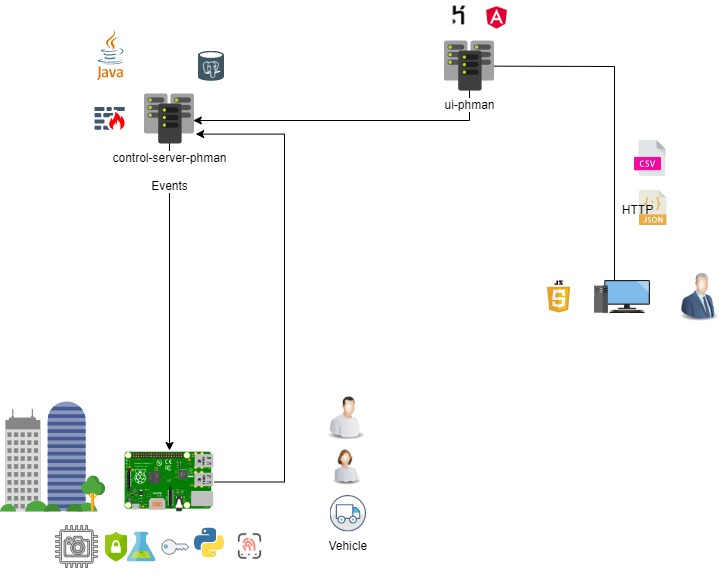

## RASPERRY PI - PH MAN
#### Interactions

#### Folders

    .
    ├── components              # python modules files 
    |   ├── config              
    │   ├── db                  
    │   └── util                
    ├── exceptions              # own exceptions
    ├── frontend
    |   ├── controllers
    |   ├── css
    |   ├── media               # pictures
    |   └──  uis                # qt files 
    ├── models                   
    ├── tests                   # Automated tests 
    ├── LICENSE
    └── README.md

#### Setting

Make sure to install requirements libraries before to run the project, throught .
<<<<<<< HEAD

=======
>>>>>>> develop
     pip install -r requirements.txt 

#### How to generate python file from ui file

Make sure to have pyqt5 

    python -m PyQt5.uic.pyuic -x filename.ui -o outputfile.py